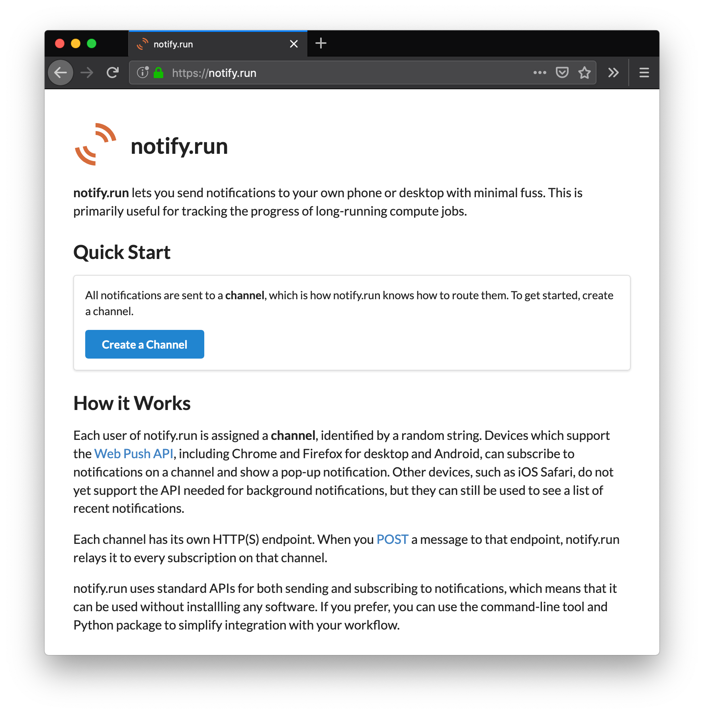

 notify.run
============================================================

**[notify.run](https://notify.run) makes it easy to programmatically send notifications to your own phone or desktop.** It is provided as a free web service that can be used without installation (on both the sending and receiving end). This repository contains the source of the web service, as well as a Python client that provides integration with Jupyter and Keras.

This repository contains the source code for the Python client, website, and server of notify.run.

- **If you are interested in using the public instance of notify.run to send notifications to yourself, you don’t need to download anything from this repo.** Just follow the instructions at [notify.run](https://notify.run).
- If you are interested in using the Python client to send notifications via notify.run, see [py_client/README.rst](py_client/README.rst).
- If you are interested in self-hosting your own notify.run server, see [notify-run-server](https://github.com/notify-run/notify-run-server).
